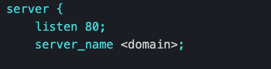
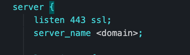
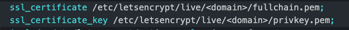
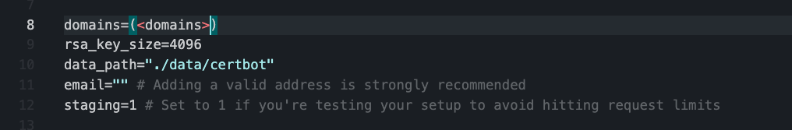
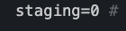

# ssl-automation
A repo to deploy and secure single server node applications/websites
This is made under the assumption that you have a working ip/domain for your website. 
You are able to run and test these commands local as well as in an ec2 shell. 

## Step 1. Install Docker && docker-compose
* [Docker](https://docs.docker.com/engine/install/)
* [docker-compose](https://docs.docker.com/compose/install/)

## Step 2. Place working application in the app folder. 
* the Dockerfile is preset to install the latest version of node and for the app to start with the command ```npm start```
* You will also need to add this code in your server *assuming it is an express server* 
```
app.use(express.static(".well-known/acme-challenge/"));

```
## Step 3. Replace <*domain*> with your ip address or domain for your website in the ```data/nginx/app.conf``` file




## Step 4. Run the following command  
```
curl -L https://raw.githubusercontent.com/wmnnd/nginx-certbot/master/init-letsencrypt.sh > init-letsencrypt.sh
``` 
followed by 
```
chmod +x init-letsencrypt.sh
```
* this command will download a file that will produce the certificate.
* Make sure to review the file so that you can stage your attempts before hitting a rate limit and that it hits the proper domain/ip


## Step 5 Run the following command 
```
sudo ./init-letsencrypt.sh
```
* You should see *Succesfully received certificate* in the console. Once you see that message change the staging value in the init-letsencrypt.sh file back to 0 and repeat this step again. 



## Step 6. Run the following command
``` 
docker-compose up --build -d
```


## For deployment
 * this setup was used with an ubuntu aws ec2 container 

## Step 1. Create aws ec2 ubuntu container

## Step 2. Follow instruction to ssh into container

## Step 3. Download Docker && docker-compose

## Step 4. Run the following command
```
scp -r -i yourkeyname.pem ~/path/to/your/project/folder/from/root ec2-user@<ec2-IPv4-publicIp>:~/

```
* make sure the path to your pem file is accurate. 
* make sure to add in your public ip
* This step will securely copy the contents of your project over to the ec2 shell.
